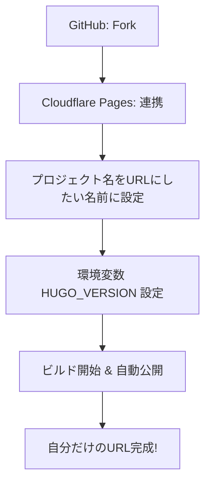
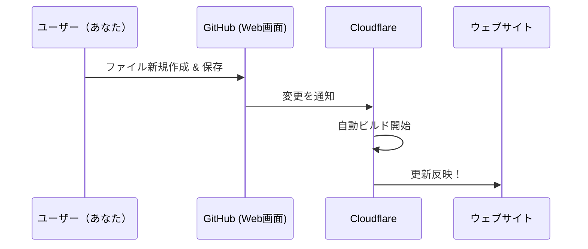

# my-simple-diary (Hugo版プラットフォーム)

このリポジトリは、**Hugo + Markdown** を活用した、シンプルで美しい日記・ポートフォリオサイトのテンプレートです。
技術的な知識がなくても、GitHub のブラウザ画面上でファイルを操作するだけで、自分専用の本格的なサイトを公開・運営できます。

---

## 🚀 始め方（詳細ガイド）

GitHub や Cloudflare に慣れていない方でも、以下のステップを順番に進めれば 10 分ほどで自分のサイトが立ち上がります。

### Step 1: 自分専用のリポジトリを作る (Fork)

まずは、このプログラムを自分の GitHub アカウントにコピーします。

1. この画面の右上にある **「Fork」** ボタン（🍴 マーク）をクリックします。
2. そのまま画面の指示に従い、 **「Create fork」** をクリックします。
3. 数秒後、あなたのアカウント内に同じリポジトリ（貯蔵庫）がコピーされます。以降、あなたはこの自分のリポジトリを編集していきます。

### Step 2: Cloudflare Pages で世界に公開する

次に、コピーしたリポジトリをインターネットに公開する設定を行います。

1. [Cloudflare](https://dash.cloudflare.com/) にログインします。
2. 左メニューの **「Compute (Workers)」** ＞ **「Workers & Pages」** を開きます。
3. **「作成」** ＞ **「Pages」** ＞ **「Git に接続」** を選択します。
4. 自分の GitHub アカウントを連携し、先ほどコピーした `my-simple-diary` を選択して **「セットアップの開始」** をクリックします。
5. **ビルド設定** で以下を正確に入力します：
    - **フレームワークプリセット**: `Hugo`
    - **ビルドコマンド**: `hugo -b $CF_PAGES_URL`
    - **ビルド出力ディレクトリ**: `public`
6. **プロジェクト名の設定（重要！）**:
    - ここで入力するプロジェクト名が、そのまま `プロジェクト名.pages.dev` という URL になります。
    - 例: `myouji-namae` と入力すれば、URL は `https://myouji-namae.pages.dev/` になります。
    - **注意**: 一度作成するとプロジェクト名は後から変更できません。変更したい場合は、一度削除して作り直す必要があります。
7. **環境変数** を追加します（ここを忘れるとエラーになります）：
    - **変数名**: `HUGO_VERSION`
    - **値**: `0.146.6`
7. **「保存してデプロイ」** をクリックします。数分後、公開用の URL（`*.pages.dev`）が表示されます！



### 🌐 アドレス（URL）を好きな名前にするには？

Cloudflare Pages では、**「プロジェクト名」** がそのままサイトのアドレスになります。
- 好きな名前（例：`myouji-namae`）にしたい場合は、Step 2 の作成画面でプロジェクト名をそのように入力してください。
- **もっとこだわりたい場合**: 自分で取得した独自ドメイン（例：`example.com`）を割り当てることも可能です。デプロイ完了後、Cloudflare の「カスタムドメイン」設定から行えます。

### Step 3: 自分専用に書き換える (Personalize)

サイトの名前や自分の名前を設定します。

1. 自分のリポジトリの `hugo.toml` を開きます。
2. 右上の **鉛筆マーク（Edit）** を押して編集を開始します。
3. 以下の箇所を書き換えて、画面下の **「Commit changes」** で保存します。

```toml
title = "（ここにサイトのタイトルを書く）"

[author]
  name = "（あなたの名前）"

[params]
  authorName = "（表示される名前）"
  description = "（タイトル下に表示される説明文）"
  githubUser = "（あなたのGitHubユーザー名）"
```
75: 
76: > [!TIP]
77: > **タイトル下の説明文を変更するには？**: `hugo.toml` の `description = "..."` の部分を書き換えるだけで、サイトの印象をガラッと変えることができます。
78: 
79: ---
80: 
81: ## 🦋 BlueSky への自動投稿（オプション）
82: 
83: 日記を新しく公開した時に、自動的に BlueSky に通知を送ることができます。
84: 
85: 1. GitHub のリポジトリ画面で **[Settings]** ＞ **[Secrets and variables]** ＞ **[Actions]** を開きます。
86: 2. **[New repository secret]** をクリックして、以下の 2 つを登録します。
87:     - **Name**: `BLUESKY_IDENTIFIER` / **Value**: あなたのハンドル名（例: `xxx.bsky.social`）
88:     - **Name**: `BLUESKY_PASSWORD` / **Value**: BlueSky の「アプリパスワード」
89: 3. これで、`main` ブランチに新しい日記を追加するたびに、BlueSky へ自動投稿されます。
90: 

---

## ✍️ 日記の書き方（運用フロー）

専門的な知識は不要です。ブラウザだけで完結します。

1. `content/diary/` フォルダを開きます。
2. **[Add file]** ＞ **「Create new file」** をクリック。
3. ファイル名を `2026-04-01.md`（今日の日付.md）にします。
4. 最初から入っているテンプレートに従い、内容を書き換えます。
5. **「Commit changes」** をクリックして保存すれば、数分後にサイトが自動更新されます！



---

## 🛠 技術的な仕組み

- **Hugo**: 世界最速レベルの静的サイト生成ツール。
- **Vanilla CSS**: `static/style.css` で全てのデザインを管理。
- **生HTML対応**: `hugo.toml` の `unsafe = true` により、Markdown 内に HTML タグ（`<p>` や ``）を直接埋め込むことも可能です。

## 🤖 エージェント管理

このプロジェクトは Antigravity のベストプラクティスに基づき管理されています。
詳細は `.agent/` ディレクトリ配下を参照してください。
- [ミッション概要](.agent/mission.md)
- [記事の書き方のコツ](.agent/skills/add_diary_entry.md)

---
